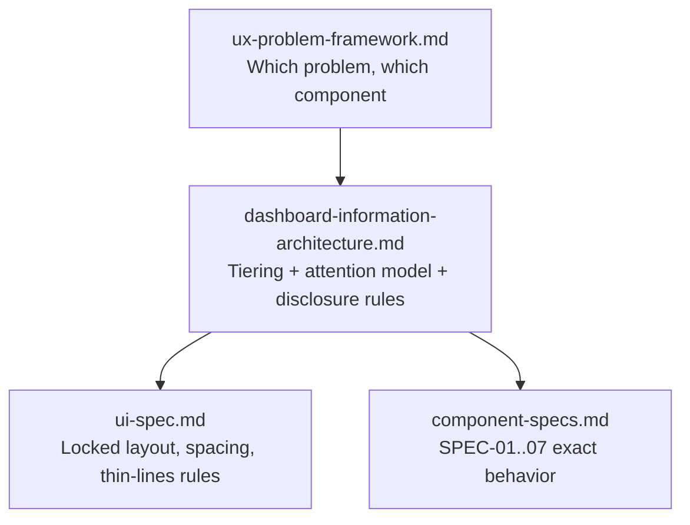
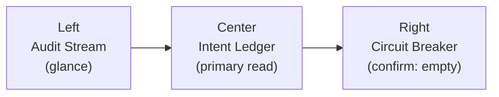
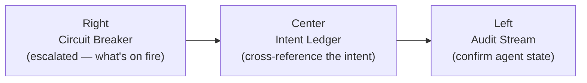

# Dashboard Information Architecture: Apex Logic Control Plane
> The content-priority and attention-hierarchy layer — what's always-visible vs. on-demand across the whole screen, and how scan order changes when the system needs a human.

---

## 0. Why This Doc Exists

`ui-spec.md` and `component-specs.md` already lock a lot: the 25/45/30 column split, per-component zone ordering (`plainenglish-before-diff`), spacing scale, and status-color tokens. What they don't answer is the **cross-component, cross-column** question: given six data-dense specs each with their own fields, which fields matter most *on the whole screen*, and — since this is a circuit-breaker monitoring tool, not a static report — how does scan order change when something goes wrong.

**Scope note:** this pass defines hierarchy and disclosure for the current fixed dataset shape (`src/data/mockLedgerData.json`). High-volume/overload handling (caps, pagination, sort-by-severity truncation for 10+ anomalies or 100+ ledger rows) and responsive/mobile breakpoints are explicitly deferred — see Section 4.

---

## 1. Visual Hierarchy Tiers (Tier 0-3)

Every field in the product belongs to exactly one tier. Tiers are ordered by how much a human needs the information *to make a decision right now*, not by how technically interesting the data is.

| Tier | Definition | Treatment |
|---|---|---|
| **Tier 0 — Interrupt / Command** | Demands action or acknowledgement. Never hidden, never dimmed, always animated when active. | Full contrast, `animate-pulse` where applicable, largest touch targets. |
| **Tier 1 — Primary Decision Data** | What a human reads to understand *why* something happened and *whether it matters*. | Always visible, `font-sans` (human-readable), highest text contrast after Tier 0. |
| **Tier 2 — Supporting Technical Context** | Confirms or contextualizes Tier 1 for someone who wants to verify it. | Visible at a glance, `font-mono`, dimmer contrast (`text-neutral-400`/`text-neutral-300`). |
| **Tier 3 — On-Demand / Deep** | Proof-of-work detail. Needed rarely, but must be one click away. | Collapsed by default, expandable, never pre-loaded into the primary scan path. |

### Tier Assignment — Master Table

| Field / Element | Source Spec | Tier | Existing Constraint |
|---|---|---|---|
| `[EMERGENCY STOP]` button | SPEC-05 SystemHeader | 0 | — |
| `[PAUSED]` pulsing badge | SPEC-02 AgentBlock | 0 | `paused-state-must-pulse` |
| `[Approve & Sign]` / `[Reject & Kill]` | SPEC-03 AnomalyCard | 0 | — |
| Expiry countdown (`expirySeconds`) | SPEC-03 AnomalyCard | 0 | — |
| `humanIntent` (Ledger Zone A) | SPEC-01 LedgerRow | 1 | `humanIntent-always-visible` (PS-01) |
| `humanIntent` / `businessImpact` (Anomaly Zone 1) | SPEC-03 AnomalyCard | 1 | `plainenglish-before-diff` (PS-04, PS-06) |
| `machineAssumption` | SPEC-01, SPEC-03 | 1 | PS-01 |
| Headline `financials.cogs` / `financials.aer` | SPEC-01 LedgerRow, SPEC-05 header totals | 1 | `cogs-always-prominent` (PS-05) |
| `anomaly.title` / `severity` | SPEC-03 AnomalyCard | 1 | — |
| `technicalMetrics.model` / `latencyVariance` | SPEC-01 LedgerRow (Zone B) | 2 | — |
| `intentDriftVariance` | SPEC-01 LedgerRow (Zone B) | 2 | amber >25% (`ui-spec.md`) |
| `contextWindowUsage` | SPEC-01 LedgerRow (Zone B) | 2 | amber >80%, crimson >90% |
| Agent `role`, `metrics` (model/latency/tokenVelocity) | SPEC-02 AgentBlock | 2 | — |
| Terminal log lines | SPEC-04 TerminalLog | 2 | `terminal-continuous-scroll` (PS-02) |
| IMDA compliance pillars | SPEC-06 ComplianceBadgeStrip | 2 | — |
| `technicalTrace.proposedDiff` | SPEC-03 AnomalyCard (Zone 2) | 3 | `plainenglish-before-diff` — collapsed by default |
| `technicalTrace.promptVariance` | SPEC-03 AnomalyCard (Zone 2) | 3 | — |
| `technicalTrace.estimatedCost` | SPEC-03 AnomalyCard (Zone 2) | 3 | — |

Reading this table: nothing here is a new invention. Every tier is a consolidation of a constraint that already exists somewhere in `component-specs.md`, `ui-spec.md`, or `src/data/users.js`. What's new is that they're now ranked against each other on one shared scale.

---

## 2. Cross-Column Attention Model

The three columns are not equally urgent at all times. This is a governance circuit-breaker tool — when the Right column has something trapped, it should out-rank the Center column's normal review cadence, not wait its turn in a static left-to-right scan.

### Steady State (`trappedAnomalies.length === 0`)

Nothing is trapped. Scan order follows natural column order: registry glance, ledger review, confirm the gate is clear.

### Interrupt State (1+ active anomalies)

The Right column visually escalates and the intended scan order inverts: what's on fire, then why, then which agent.

### The Escalation Rule (New Decision)

When `trappedAnomalies.length > 0`:

- The Circuit-Breaking Gate column header (`layout.columnHeader` in `theme.js`) swaps its border from `border-neutral-800/60` to the **highest active severity token already defined** in `theme.js` — `tokens.crimson.border` if any anomaly is `critical`, otherwise `tokens.amber.border`.
- The column header renders a small pulsing count badge, e.g. `● 2 PENDING`, using the same severity token's `.dot` and `.badge` classes — no new tokens are introduced.
- No shadows, glows, or gradients are used to achieve this — the escalation is entirely border-color and the existing `animate-pulse` utility, staying inside the locked "Thin-Lines" rule.
- This is a column-level signal layered on top of (not replacing) the existing per-card `paused-state-must-pulse` rule on individual `AgentBlock`s.

This is a genuinely new decision (not a reopening of a locked one) and is logged as `DECISION-6` in `memory-bank/DECISIONS.md`, with the exact implementation contract specified in a new `SPEC-07` in `component-specs.md` and a new section in `ui-spec.md` (see Section 5).

---

## 3. Progressive Disclosure Matrix

One reference table for every field in the product. `Always` = rendered unconditionally in the default view. `Glance` = visible without interaction, but secondary in visual weight. `On-Demand` = requires a click (expand, hover-detail, etc.).

| Field | Component / Zone | Tier | Visibility | Constraint ID |
|---|---|---|---|---|
| `humanIntent` | LedgerRow · Zone A | 1 | Always | PS-01 / `humanIntent-always-visible` |
| `machineAssumption` | LedgerRow · Zone A | 1 | Always | PS-01 |
| `technicalMetrics.model` | LedgerRow · Zone B | 2 | Glance | — |
| `technicalMetrics.latencyVariance` | LedgerRow · Zone B | 2 | Glance | — |
| `financials.cogs` / `financials.aer` | LedgerRow · Zone B | 1 | Glance, visually weighted as Tier 1 | PS-05 / `cogs-always-prominent` |
| `intentDriftVariance` | LedgerRow · Zone B | 2 | Glance (amber >25%) | — |
| `contextWindowUsage` | LedgerRow · Zone B | 2 | Glance (amber >80%, crimson >90%) | — |
| `agent.status` badge | AgentBlock | 0 (paused) / 2 (other) | Always | `paused-state-must-pulse` |
| `agent.role`, `agent.metrics` | AgentBlock | 2 | Glance | — |
| `anomaly.title`, `severity` | AnomalyCard · Zone 1 | 1 | Always | — |
| `anomaly.humanIntent`, `businessImpact`, `machineAssumption` | AnomalyCard · Zone 1 | 1 | Always | PS-04 / PS-06 / `plainenglish-before-diff` |
| `expirySeconds` countdown | AnomalyCard · Zone 1 | 0 | Always, ticking | — |
| `[Approve & Sign]` / `[Reject & Kill]` | AnomalyCard · Zone 1 | 0 | Always | — |
| `technicalTrace.proposedDiff` | AnomalyCard · Zone 2 | 3 | On-Demand (collapsed by default) | `plainenglish-before-diff` |
| `technicalTrace.promptVariance` | AnomalyCard · Zone 2 | 3 | On-Demand | — |
| `technicalTrace.estimatedCost` | AnomalyCard · Zone 2 | 3 | On-Demand | — |
| Terminal log lines | TerminalLog | 2 | Glance, continuous | PS-02 / `terminal-continuous-scroll` |
| 4 header metrics (tokens, COGS, AER, leakage) | SystemHeader | 1 | Always | — |
| `[EMERGENCY STOP]` | SystemHeader | 0 | Always | — |
| IMDA compliance pillars | ComplianceBadgeStrip | 2 | Glance | — |
| Column header severity escalation | ThreeColumnLayout (new, SPEC-07) | 0 | Always when active | New — see Section 2 |

If a future field doesn't fit a row here, it needs a tier and a visibility rule added to this table before it gets built — not decided ad hoc inside a component.

---

## 4. Explicit Non-Goals (Deferred)

- **High-volume / overload handling.** The current mock dataset is small (4 agents, 4 ledger rows, 2 anomalies). Rules for what happens at 10+ trapped anomalies or 100+ ledger rows (severity-sort, caps, "N more" overflow, virtualization) are deliberately not defined here — revisit once real data volume expectations are known.
- **Responsive / mobile breakpoints.** This is treated as a fixed-desktop control-room tool per `lean-prd.md`'s scope guardrails. That's an open assumption, not a decision — flagged here so it isn't silently assumed away.
- **Sparklines / micro-visualizations.** Not requested and not defined. If trend visualization (e.g. AER over time) becomes a goal, it needs its own pass.

---

## 5. Downstream Additions Required

Because the attention model in Section 2 is a new decision, it needs to be reflected in the engineering-facing docs it will eventually drive, before `AppContext.jsx` / `ThreeColumnLayout.jsx` are built:

- `src/docs/branding/ui-spec.md` — new "Cross-Column Attention State" section.
- `src/docs/component-specs.md` — new `SPEC-07: ColumnAttentionState`.
- `memory-bank/DECISIONS.md` — `DECISION-6`.
- `memory-bank/COMPONENT_MAP.md` — new cascade row for `trappedAnomalies[]` → `ThreeColumnLayout.jsx`.
