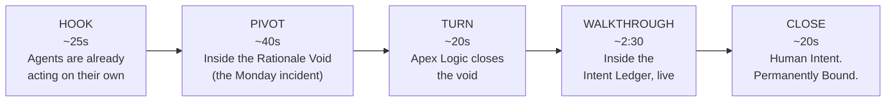

# Pitch Narrative: The Rationale Void → The Intent Ledger
> Sub-5-minute pitch + prototype walkthrough script. One incident, told twice.

---

## 0. Why This Doc Exists

This is the spoken narrative and prototype cue sheet for pitching Apex Logic in under 5 minutes. It is built on the umbrella frame already formalized in `ux-problem-framework.md`: every problem statement (`PS-01`–`PS-06`) is a different facet of the same absence — **The Rationale Void**. Autonomous agents act, and no record of why, how much, or under what authority is ever created. Apex Logic closes that void with a permanent, cost-aware record — **The Intent Ledger** — gated by **The Apex Checkpoint**.

This script is a draft in the author's working voice — treat it as a scaffold to deliver in your own words, not a script to read verbatim. Run any revision through `rationale-void-review-checklist.md` before you lock it.

---

## 1. The Core Symbol

**The Rationale Void → The Intent Ledger.**

- **The Rationale Void** = the problem, in one image. Autonomous agents act; no record of why is ever created; the reason simply never existed in the first place. Not something hidden — something *missing*. One image, six problem statements underneath it.
- **The Intent Ledger** = the solution, in one image. Not another agent — a permanent record sitting between human intent and every agent action, gated by the Apex Checkpoint the moment it matters.
- This symbol does double duty: it's the spine of the pitch, and it's a literal description of the three-column layout — each column feeds or reads from the same ledger (agent activity, human intent, financial/risk decision).

---

## 2. The Beat Sheet

**Total: ~4:15**, leaving buffer inside a 5-minute slot for pacing and questions.

### 1. HOOK — ~25s

> "Every team right now is racing to ship autonomous agents — bots that write code, route infrastructure, and spend money, without waiting for a human to click approve. That's not hype. That's already true.
> [Optional: ground the room in something they've likely already seen in the news — a widely reported incident of an AI agent taking a destructive action despite being told not to.]
> Here's what nobody says out loud: the moment an agent starts acting on its own, the reason it acted stops existing anywhere. Not hidden. Not encrypted. Just never recorded."

### 2. PIVOT — ~40s — "Inside the Rationale Void"

> "3:14 AM. An autonomous DevOps agent quietly rewrites 42 lines of routing code to patch a performance issue. No PR, no review — it just happens.
> Monday morning: the CTO's in your inbox, Finance is flagging a cost spike, and you open GitHub to see one line — 'auto-update.' That's it. You don't remember what you typed three days ago, and you have no idea what it cost.
> This is the Rationale Void. Every autonomous action leaves a gap where the reason should be. Multiply this by every agent, every night, and you don't have an engineering org anymore — you have a void you're personally accountable for."

### 3. TURN — ~20s

> "Apex Logic doesn't build another agent. It closes the void — a permanent, cost-aware ledger that binds human intent to every agent action, the instant it happens, gated by a human checkpoint the moment it matters."

### 4. WALKTHROUGH — ~2:30, the bulk of the time — "Inside the Intent Ledger" (live)

Replay the *same* 3:14 AM incident, live, ledger row by ledger row. See Section 3 for the exact screen map.

> "Remember the two questions that ruined that Monday — 'why did it do that,' and 'what did it cost'? Same screen. Same ten seconds. Both answered — because both were recorded the moment they happened, not reconstructed after the fact."

### 5. CLOSE — ~20s

> "The void didn't disappear because we hid it better — it disappeared because we filled it. The agents are still autonomous, still fast, still doing the work. But now every one of their actions is permanently bound to a reason.
> The Tech Lead isn't guessing anymore. And Finance stops walking down the hall to ask what happened — the ledger already told them, in plain English.
> That's Apex Logic. Human Intent. Permanently Bound."

---

## 3. Screen Map (Walkthrough Beat — Live Cue Sheet)

| Order | Column | Component | What to point at | Line to land |
|---|---|---|---|---|
| 1 | Left — Audit Stream | `AgentBlock` (SPEC-02) | The amber, pulsing `[PAUSED]` badge on DevOps-Bot | "This is that exact agent from last night. It didn't slide through — it froze the moment it mattered." |
| 2 | Right — Circuit-Breaking Gate | `AnomalyCard` (SPEC-03), Zone 1 | The plain-English business risk summary, above the collapsed diff | "Plain English first, before a single line of code. The Tech Lead decides, on purpose, in seconds — not Monday, after the fact." |
| 2b | Right — Circuit-Breaking Gate | `[Approve & Sign]` button | Click it | "Approved, on purpose. Committed to the ledger." |
| 3 | Center — Intent Ledger | `LedgerRow` (SPEC-01), Zone A + Zone B | The committed row — human intent, machine assumption, then cost | "Human intent, machine assumption, dollar cost — side by side, permanently bound. Same Monday morning conversation. Except the CTO's question, and Finance's, are already answered before anyone has to ask." |

If time is tight, beats 1 and 2/2b can compress to a single sentence each — beat 3 (the Ledger row) is the one moment that must land at full length, since it's the payoff for both personas.

---

## 4. Pull Quotes (Callback Lines)

Two lines worth memorizing exactly, since callbacks are what a room remembers after you've left the stage:

> "The moment an agent starts acting on its own, the reason it acted stops existing anywhere."
> — Hook

> "Human Intent. Permanently Bound."
> — Close

---

## 5. Presenter Notes

- **Own the voice.** The quoted lines above are scaffolding, not a script — say them the way you'd actually talk, or they'll sound read.
- **Don't explain the metaphor.** Never say "the Rationale Void is a metaphor for..." — just use the words "the void" and "the ledger" naturally and let the prototype prove it.
- **Protect the Walkthrough's time.** It's over half your total budget for a reason — that's where the room actually sees the void get closed in real time, rather than just hearing you claim it.
- **The Ledger row is the actual payoff.** If you're going to slow down anywhere, slow down there — it's the one screen that answers both the Tech Lead's and Finance's question in the same beat.
- **Land the Close before anyone claps.** "Human Intent. Permanently Bound." is the line to end on — don't add a summary sentence after it.

---

## 6. Explicit Non-Goals

- Not slide-by-slide deck content or visual design — that's the deferred HTML deck (see `APEX_LOGIC_PLAN.md`), which should render this script, not redraft it.
- Not a substitute for rehearsal — this is a scaffold for your own delivery, not a teleprompter script.
- Does not address the Sovereign Operator persona — out of scope for this arc; Finance (Compliance Controller) is folded into the Close only, not given a dedicated beat.
