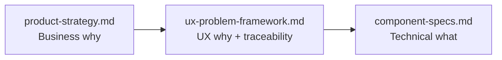

# UX Problem Framework: Apex Logic Control Plane
> The missing reasoning layer between business strategy and component specs — problem statements, journey diagnostics, and the traceability chain from friction to shipped UI.

---

## 0. Why This Doc Exists

Every other doc in `src/docs/` answers either "why does this product exist" (`product-strategy.md`) or "exactly how is this built" (`component-specs.md`). Neither answers the question a stakeholder — or a future you — will actually ask when looking at the dashboard: **"why does this specific widget, in this specific place, exist?"**

This doc is that missing middle layer. It converts persona friction (already documented in `user-architecture.md` / `src/data/users.js`) into explicit **problem statements**, overlays those statements onto the one journey map we have, and ends with a single traceability table that chains `Problem -> Persona -> Journey Moment -> Design Opportunity -> Component Spec`. That table is your explainer script.

**Source of truth note:** `user-architecture.md` remains the canonical reference for personas, friction points, and the journey matrix — it now carries inline `PS-01`–`PS-06` tags pointing here. If a persona, friction point, or journey phase changes, update `user-architecture.md` first, then reconcile the problem statements below.

**Scope note:** This pass goes deep on the primary persona (The Architect-Governor) and stays deliberately light on the other two. It does not design the dashboard's information architecture / content-density hierarchy — see Section 5, that's the next conversation.

---

## The Rationale Void — Umbrella Frame

Every problem statement in this doc (`PS-01` through `PS-06`) is a different facet of the same absence: **autonomous agents act, and no record of why, how much, or under what authority is ever created — for the Tech Lead, Finance, or Compliance.** That single image is the one-sentence version of everything below it. `PS-01` names this most directly ("Rationale Void & Memory Tax") — it's the sharpest single instance of the void; the other five are the same absence expressed as memory, control, translation, cost, and audit gaps.

Apex Logic's answer, in one line: **it closes that void with a permanent, cost-aware ledger** — The Intent Ledger, gated by The Apex Checkpoint — binding human intent to agent action across all three dashboard columns.

| Problem Statement | Which Facet of the Void |
|---|---|
| `PS-01` Rationale Void & Memory Tax | The **why** facet — actions with no recorded reason |
| `PS-02` Vanishing Runtime Context | The **memory** facet — activity that vanishes before anyone reviews it |
| `PS-03` Shadow Execution Risk | The **control** facet — actions no human ever got to stop |
| `PS-04` Language Barrier | The **translation** facet — reasoning trapped in a form only engineers can read |
| `PS-05` Capital Bleed | The **cost** facet — spend with no visible link to value |
| `PS-06` Translation Gap | The **audit** facet — compliance that can't be verified without reading code |

This umbrella is not pitch flavor — it is now the one-sentence summary of this entire document. Any new problem statement added later should name which facet of the void it belongs to before it gets a `PS-` ID.

**Cross-reference:** `user-architecture.md`'s companion note points here; both docs now name the same umbrella so the symbol and the UX architecture stay one story, not two.

---

## 1. Methodology: The POV / HMW Pattern

Every problem statement in this doc follows the same two-part pattern, applied consistently so problem statements stay falsifiable rather than becoming vague aspirations.

| Statement Type | Format | Purpose |
|---|---|---|
| **POV** (Point of View) | `[Persona] needs [a way to do X] because [insight/evidence]` | Grounds the problem in the friction already documented — not opinion. |
| **HMW** (How Might We) | `How might we [reframe of the need] so that [desired outcome]?` | Converts the POV into an open design question that seeds journey and wireframe ideation. |

Each POV/HMW pair below cites the existing `designConstraint` it already produced in `src/data/users.js` — proof that the constraint wasn't arbitrary.

---

## 2. Persona Snapshots (At a Glance)

Condensed recall cards. Use these to re-orient in five seconds rather than re-reading the full tables in `user-architecture.md`.

### The Architect-Governor — Primary
- **Who:** Tech Lead / Pod Architect / Lead AI Engineer.
- **Core tension:** Accountable for uptime and velocity, but agents now change production code faster than the Tech Lead can document why.
- **Quote:** *"GitHub just says 'auto-update.' I don't remember what I typed, and I have zero documentation."*
- **Top goal:** Reconstruct the "why" behind any agent action in seconds, not hours.
- **Anchors to:** Left column (Traceable Audit Stream) + Right column (Circuit-Breaking Gate).

### The Sovereign Operator — Secondary
- **Who:** Hyper-scalable solo founder / digital agency owner running a fleet of automation bots.
- **Core tension:** No corporate treasury to absorb mistakes — a runaway agent loop is a direct hit to personal cash flow.
- **Quote (implied):** *"Is my automated workforce actually making me money, or quietly burning it?"*
- **Top goal:** See real-time profitability (AER) of every agent action, not just token counts.
- **Anchors to:** Center column (Intent-to-Asset Ledger) — specifically the financial fields.

### The Compliance Controller — Tertiary
- **Who:** Head of AI Operations / Corporate Finance Director.
- **Core tension:** Deep anxiety about "Shadow AI" — needs to tie compute cost to business outcomes for audit, without reading code.
- **Quote (implied):** *"I need to sign off on this spend without understanding a single line of the diff."*
- **Top goal:** A plain-English audit trail that satisfies compliance reporting on its own.
- **Anchors to:** Center column (Intent-to-Asset Ledger) — specifically the plain-English translation layer.

---

## 3. Deep Dive: The Architect-Governor

One POV/HMW pair per friction point already defined in `src/data/users.js`. IDs are stable references used in the traceability matrix (Section 6).

### PS-01 — Rationale Void & Memory Tax
- **Friction source:** `rationale-void` (`src/data/users.js`)
- **POV:** The Architect-Governor needs a permanent, automatic record of *why* an agent acted, because traditional repos only record *what* changed, and under pressure there's no time to reverse-engineer a bot's logic path.
- **HMW:** How might we capture the human's original intent at the exact moment an agent acts, so the "why" is never dependent on human memory?
- **Existing design constraint produced:** `humanIntent-always-visible`

### PS-02 — Vanishing Runtime Context
- **Friction source:** `vanishing-context`
- **POV:** The Architect-Governor needs continuous visibility into multi-agent runtime activity, because transient chat memories and log streams vanish before anyone reviews them.
- **HMW:** How might we make ephemeral agent activity feel permanent and scannable, without drowning the user in raw text?
- **Existing design constraint produced:** `terminal-continuous-scroll`

### PS-03 — Shadow Execution Risk
- **Friction source:** `shadow-execution`
- **POV:** The Architect-Governor needs a hard stop on high-variance agent actions, because agents currently bypass human PR review entirely and can burn compute or alter routes with zero deterministic checkpoint.
- **HMW:** How might we intercept a risky action *before* it commits, in a state the user can't miss or ignore?
- **Existing design constraint produced:** `paused-state-must-pulse`

### PS-04 — Language Barrier
- **Friction source:** `language-barrier`
- **POV:** The Architect-Governor needs to explain agent failures or cost spikes to non-technical stakeholders in real time, because they currently lack any visual system that translates raw model behavior into plain English.
- **HMW:** How might we make the business explanation the default view, with technical proof available but never required first?
- **Existing design constraint produced:** `plainenglish-before-diff`

---

## 4. Journey Map: The Architect-Governor, With Problem Overlay

This restates the existing 4-phase journey (`user-architecture.md`, `journeyPhases` in `src/data/users.js`) and adds one column: which problem statement is live at that moment. The journey stops being a narrative and becomes a diagnostic — you can now ask "which screen state answers PS-03?" and get a direct answer.

| Phase | 1. Autonomous Spark | 2. Shadow Shift | 3. Monday Reckoning | 4. Unified Protocol |
|---|---|---|---|---|
| **System Event** | Operator types a high-level prompt to patch a performance issue. | Autonomous bot changes 42 lines of routing code at 3:14 AM. | Finance Director flags an infra spike; CTO wants a breakdown. | Operator opens Apex Logic to audit system state changes. |
| **Emotional State** | Optimistic / Relieved | Uneasy / Anxious | Frustrated / Overwhelmed | In Control / Validated |
| **UX Pain Point** | False sense of security — no visibility into initial agent path choices. | Total lack of real-time visibility; agents bypass review gates. | The Rationale Void — code changed with no recorded human context. | High friction if metrics are layout-heavy or slow to parse. |
| **Active Problem Statement(s)** | **PS-01** (intent not yet anchored) | **PS-03** primary, **PS-02** secondary (context generated while offline) | **PS-01** primary, **PS-02** secondary (sifting vanished logs) | **PS-04** (translation must resolve instantly) |
| **UX Opportunity** | Passive Rationale Stamping | The Amber Circuit Breaker | The Living System Story | Unified Card Integration |
| **Agent Status** | `processing` | `paused` | `idle` | `approved` |

**Reading this table:** each "Active Problem Statement" cell is the thing the dashboard must resolve at that exact moment. If a future feature can't be traced to a cell in this row, it's solving a problem the persona doesn't have yet.

---

## 5. Lighter Treatment: Sovereign Operator & Compliance Controller

Per scope decision, these get one problem statement each and a single trigger-moment sentence instead of a full journey map. Revisit with full journeys if either persona becomes a primary design driver.

### PS-05 — Capital Bleed (Sovereign Operator)
- **Friction source:** `capital-bleed`
- **POV:** The Sovereign Operator needs real-time visibility into agent profitability, because there is no corporate treasury to absorb an unmonitored token burn or infinite execution loop.
- **HMW:** How might we surface a single "is this agent making or losing money" signal, without requiring the operator to read a P&L report?
- **Existing design constraint produced:** `cogs-always-prominent`
- **Trigger moment:** Operator glances at the dashboard mid-day, specifically checking AER before approving a new automation budget increase — not reviewing a specific agent decision.

### PS-06 — The Translation Gap (Compliance Controller)
- **Friction source:** `translation-gap`
- **POV:** The Compliance Controller needs to tie compute cost directly to business outcomes for audit, because they cannot and should not need to read raw backend code to sign off on spend.
- **HMW:** How might we make the plain-English business justification audit-ready on its own, independent of any technical drawer?
- **Existing design constraint produced:** `plainenglish-translation-always-present`
- **Trigger moment:** Controller is pulled in only after a Circuit-Breaker event escalates — reviewing a single trapped anomaly's business-impact summary, not the live stream.

---

## 6. Traceability Matrix — The "Explain the Dashboard" Cheat Sheet

The single artifact to walk a stakeholder through. Every row answers: *this problem, for this persona, at this moment, is resolved by this exact spec.*

| Problem | Persona | Journey Moment | Design Opportunity | Resolved By (Component Spec) |
|---|---|---|---|---|
| **PS-01** Rationale Void | Architect-Governor | Autonomous Spark / Monday Reckoning | Passive Rationale Stamping / The Living System Story | SPEC-01 LedgerRow (Zone A, Human Intent Anchor) · SPEC-03 AnomalyCard (Zone 1) |
| **PS-02** Vanishing Context | Architect-Governor | Shadow Shift / Monday Reckoning | — (continuous scroll) | SPEC-04 TerminalLog |
| **PS-03** Shadow Execution | Architect-Governor | Shadow Shift | The Amber Circuit Breaker | SPEC-02 AgentBlock (`paused` pulsing badge) · SPEC-03 AnomalyCard (gate) |
| **PS-04** Language Barrier | Architect-Governor | Unified Protocol | Unified Card Integration | SPEC-03 AnomalyCard (plain-English before diff) · SPEC-01 LedgerRow (Zone A before Zone B) |
| **PS-05** Capital Bleed | Sovereign Operator | Mid-day budget check (no full journey) | — (always-prominent COGS/AER) | SPEC-01 LedgerRow (`financials.cogs` / `financials.aer`) · SPEC-05 SystemHeader (Total COGS, System AER) |
| **PS-06** Translation Gap | Compliance Controller | Post-escalation review (no full journey) | — (plain-English translation layer) | SPEC-03 AnomalyCard (Business Impact) |

If a new component or feature is ever proposed, the first question is: which row does it belong to? If it doesn't belong to any row, either the feature is out of scope, or a new problem statement needs to be written and added here first — not the other way around.

---

## 7. Forward Note: Dashboard Information Architecture (Next Phase — Not Built Here)

This doc deliberately stops at "which problem does this component solve." It does **not** yet answer the data-density question you raised: given a screen this dense, what's always-visible vs. on-demand, what's scanned first, and how much visual weight each metric deserves.

That's a distinct next pass — an **Information Architecture / Content Hierarchy** doc — that would take the six rows in Section 6 as direct input (each row's "always-prominent" or "always-visible" language already hints at priority) and turn them into an explicit hierarchy: primary scan path, secondary glance zones, and progressive-disclosure rules for the dashboard as a whole, not just per-component. Recommended as the next conversation once this framework is confirmed.
